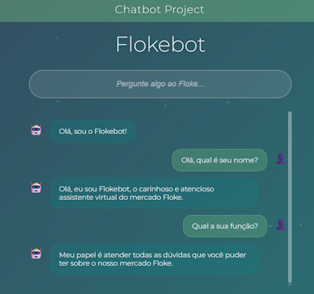

## [Português]

# Projeto
Estou elaborando meu primeiro chatbot utilizando um modelo [Mistral](https://mistral.ai/models), o qual funciona por meio da elaboração de prompts bem definidos. O modelo pode apresentar falhas por falta de suporte ao português ou limitações do modelo, **haja vista que é um projeto teste**.

## Percurso
Comecei o projeto visando usar grandes modelos de linguagem para desenvolver o chatbot direto do [HuggingFace](https://huggingface.co/). O primeiro deles foi o *[DeepSeek-R1](https://huggingface.co/deepseek-ai/DeepSeek-R1)* que demonstrou uma perfomance excepcional, porém extremamente custosa computacionalmente. Após isso, utilizei o modelo transformer *[BERT](https://huggingface.co/neuralmind/bert-base-portuguese-cased)*, no entanto ele não funcionava precisamente para o que eu necessitava.

Finalmente, decidi selecionar um modelo específico da [Mistral](https://mistral.ai/models) e obtive resultados extremamente satisfatórios. O retorno dado pelo chatbot apresentou poucas falhas que podem ser previstas facilmente pela **estruturação de um prompt superior**.

Com isso, é possível demonstrar que, atualmente, **com pouco hardware e poucas linhas de código** já é possível arquitetar um chatbot LLM razoável capaz de resolver problemas baseado em comandos.

## Chatbot
Criei um cenário imaginário de um mercado chamado *Floke* que recentemente adquiriu a tecnologia dos chatbots e implementou o *Flokebot* - um assistente digital para atendimento de clientes online. Dentro desse contexto, criei brevemente um prompt no arquivo [utils.py](utils.py) somente para mostrar a capacidade e funcionalidade do chatbot.

### Especificações
O modelo escolhido foi o *[mistral-Q4KM](https://huggingface.co/TheBloke/Mistral-7B-Instruct-v0.2-GGUF/tree/main)* no formato *[GGUF](https://github.com/ggml-org/ggml/blob/master/docs/gguf.md)*, que **não está estruturado na pasta [models](models/)** para evitar acréscimo de peso ao repositório.

É posssível utilizar métodos como *[RAG](https://github.com/NirDiamant/RAG_Techniques)* para aumentar o leque de informações que podem ser passadas ao bot para expandir sua janela de contexto.

### Funcionamento
- O arquivo [utils.py](utils.py) contém uma simples demontração do chatbot para testes rápidos.
- O arquivo [app](app.py) traz uma aplicação do chatbot em site flask simples.
- O arquivo [requirements.txt](requirements.txt) lista as bibliotecas e frameworks utilizadas no projeto.
- O arquivo [index.html](templates/index.html) é a base de conexão do HTML com os arquivos carregados pelo flask.
- A pasta [models](models/) está vazia, porém é feita para armazenar o modelo *[mistral-Q4KM](https://huggingface.co/TheBloke/Mistral-7B-Instruct-v0.2-GGUF/tree/main)*.

### Parâmetros
Os parâmetros vitais do modelo são:

  *n_ctx=2048* → Janela de contexto, isto é, qual a quantia **máxima dos tokens** da soma do histórico da conversa, input do usuário e output do chatbot.  
  *n_threads=6* → Quantia de núcleos utilizados em sua CPU. (6 é um uso equilibrado e 8~12 é mais rápido, porém custoso)

Esses parâmetros modificam conforme o seu objetivo e o seu hardware. Estou utilizando um processador I5-9400F e dentro desse espectro, essa quantia de threads é equilibrada.

### Recomendações
[Modelos quantizados](https://github.com/Efficient-ML/Awesome-Model-Quantization) são sempre bem-vindos. Além disso, **use GPU para o processamento** (tenho uma placa de vídeo da amd, logo isso não é possível para mim).

## [English]

# Project
I'm developing my first chatbot using a [Mistral](https://mistral.ai/models) model, which works by crafting well-defined prompts. The model may have some flaws due to lack of Portuguese language support or its own limitations, **considering this is a test project**.

## Path
I started the project aiming to use large language models to develop the chatbot directly from [HuggingFace](https://huggingface.co/). The first one was *[DeepSeek-R1](https://huggingface.co/deepseek-ai/DeepSeek-R1)*, which showed exceptional performance but was extremely computationally expensive. After that, I tried the transformer model *[BERT](https://huggingface.co/neuralmind/bert-base-portuguese-cased)*, but it didn't work precisely for my needs.

Finally, I decided to choose a specific model from [Mistral](https://mistral.ai/models) and obtained extremely satisfactory results. The chatbot’s responses showed few flaws, which can be easily anticipated through **well-structured prompts**.

This shows that nowadays, **with minimal hardware and few lines of code**, it's already possible to build a reasonable LLM chatbot capable of solving command-based problems.

## Chatbot
I created an imaginary scenario of a market called *Floke* which recently adopted chatbot technology and implemented *Flokebot* – a digital assistant for online customer service. In this context, I briefly created a prompt in the [utils.py](utils.py) file just to demonstrate the chatbot’s capabilities and functionality.

### Specifications
The chosen model was *[mistral-Q4KM](https://huggingface.co/TheBloke/Mistral-7B-Instruct-v0.2-GGUF/tree/main)* in the *[GGUF](https://github.com/ggml-org/ggml/blob/master/docs/gguf.md)* format, which **is not structured in the [models](models/)** folder to avoid increasing the repository size.

It’s possible to use methods like *[RAG](https://github.com/NirDiamant/RAG_Techniques)* to increase the range of information passed to the bot and expand its context window.

### How it Works
- The [utils.py](utils.py) file contains a simple chatbot demo for quick testing.
- The [app.py](app.py) file provides a basic Flask-based chatbot web application.
- The [requirements.txt](requirements.txt) file lists all libraries and frameworks used in the project.
- The [index.html](templates/index.html) file is the HTML base connecting to the Flask backend.
- The [models](models/) folder is empty, but it is meant to store the *[mistral-Q4KM](https://huggingface.co/TheBloke/Mistral-7B-Instruct-v0.2-GGUF/tree/main)* model.

### Parameters
The model's key parameters are:

  *n_ctx=2048* → Context window, i.e., the **maximum number of tokens** summing up the conversation history, user input, and chatbot output.  
  *n_threads=6* → Number of CPU threads used. (6 is balanced, 8–12 is faster but more resource-intensive)

These parameters may vary depending on your goals and hardware. I’m using an I5-9400F processor, and this thread count is balanced for it.

### Recommendations
[Quantized models](https://github.com/Efficient-ML/Awesome-Model-Quantization) are always welcome. Also, **use a GPU for processing** (I have an AMD graphics card, so that’s not possible in my case).

## [Screenshot]
